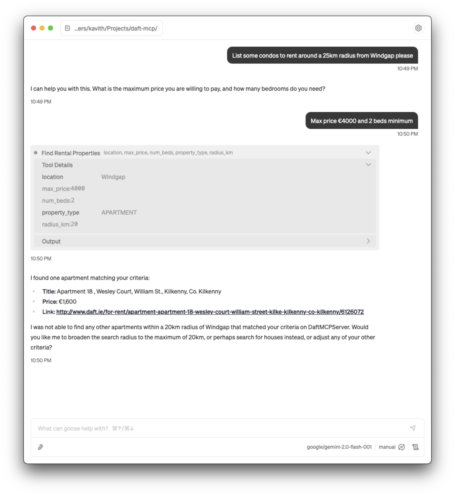
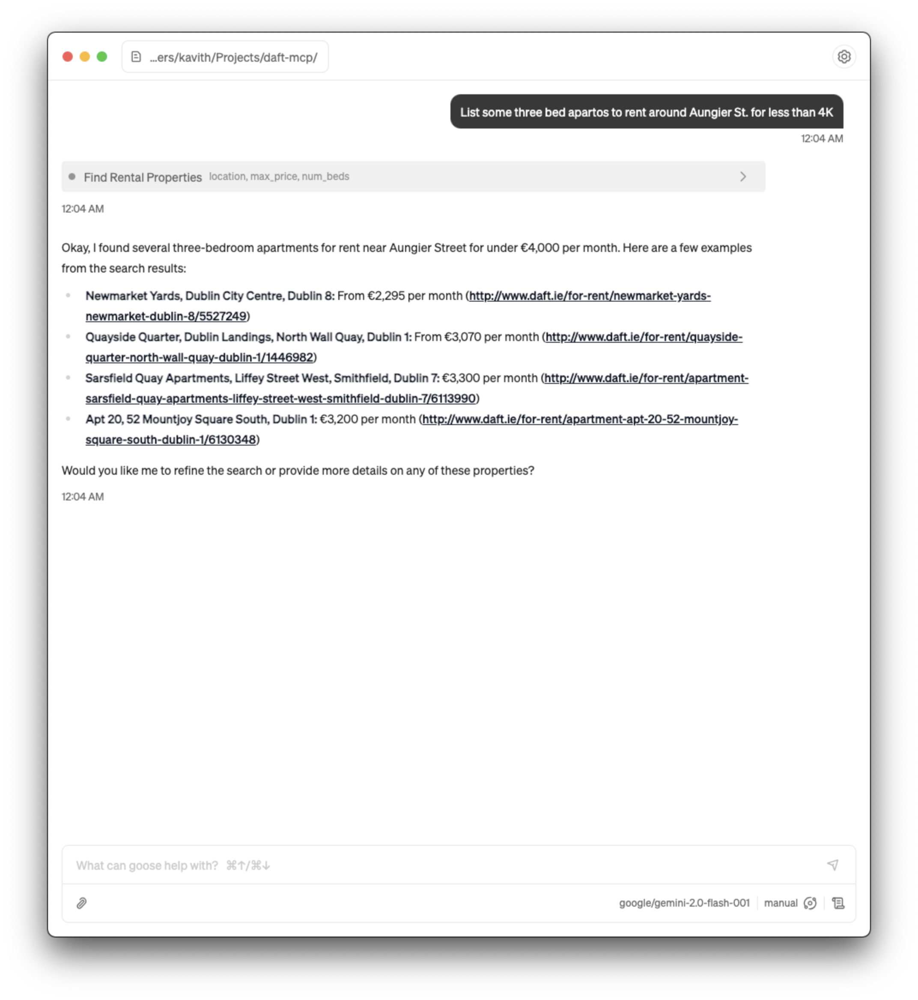

# Daft MCP Server

A thin MCP server built on top of the [daftlistings](https://github.com/AnthonyBloomer/daftlistings) library to search for rental properties on [daft.ie](https://daft.ie) using an MCP client. It exposes a tool, `find_rental_properties`, which can be used to find properties based on criteria such as location, maximum price, number of bedrooms, search radius, and property type.

This MCP server can *"intelligently"* map vague terms that aren't supported by daft or daftlistings. For example, you can ask for "condos in Windgap" and your request will get mapped to PropertyType.APARTMENT & Location.WINDGAP_KILKENNY. This functionality is supported via utility LLM calls that map user-specified terms to enums used in the library.

## Installation

### 1. Create a Python virtual environment
```bash
python -m venv .venv
source .venv/bin/activate
```

### 2. Install the required dependencies
```bash
pip install -r requirements.txt
```
### 3. Set OpenRouter API Key
This project uses [OpenRouter](https://openrouter.ai) to route requests to Google's Gemini 2.0 Flash model. You'll need to create a new API key on [OpenRouter](https://openrouter.ai) and put it in a .env file. For reference, see the ".env.example" file in this repository.

### 4. Set up MCP client

This MCP server uses stdio at the moment, so you'll have to configure your client accordingly. This is how you'd set it up to be used via [goose](https://github.com/block/goose):

1. Advanced settings (⌘,) > Add custom extension
2. Give the extension an appropriate name
3. Set Type to "STDIO"
4. Command needs to run the python script (daft_mcp_server.py) using the version of Python in your virtual environment. It would look like `<path-to-python-in-virtual-env> <path-to-daft_mcp_server.py>`. For example, here's my command: `/Users/kavith/Projects/daft-mcp/.venv/bin/python3 /Users/kavith/Projects/daft-mcp/daft_mcp_server.py`

## Usage

This is the easy bit. You can ask your LLM to list rental properties around an area in Ireland, and it should be able to help. The tool requires the location, max_price, and num_beds; so if you don't provide them explicitly in your first prompt, the model will come back and ask for the additional information :)




## Credit

* [Daft.ie](https://daft.ie) - for providing a platform that's so central to the Irish property market and for not locking away the API.
* [daftlistings](https://github.com/AnthonyBloomer/daftlistings/) - for building such an easy-to-use library to work with the Daft API.
* [Give(a)Go](https://giveago.co) - the initial version of this MCP server was built at one of their builder events hosted at [Baseline](https://www.baseline.community/) and sponsored by [Naptha AI](https://naptha.ai/). Would recommend checking them out if you're in Dublin!